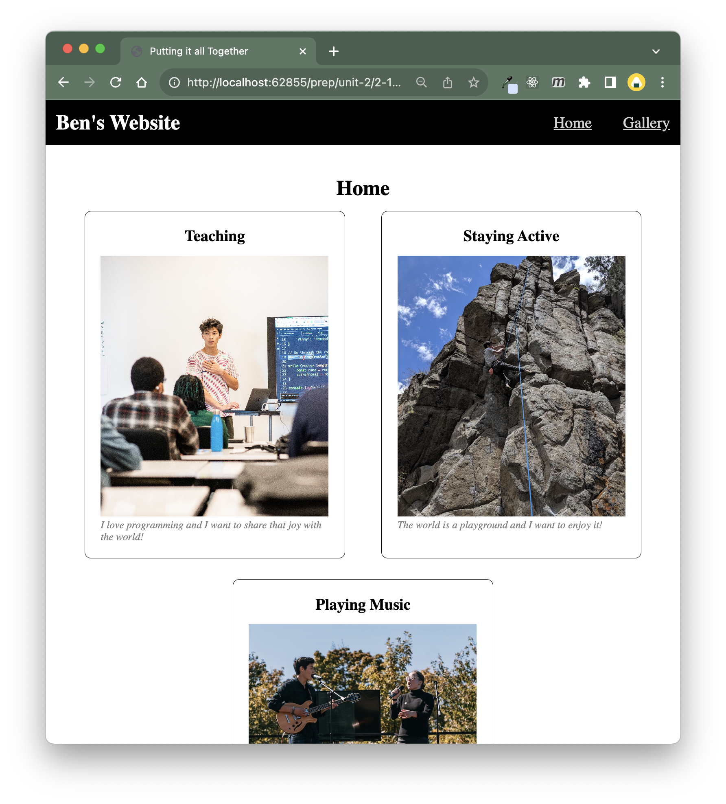

# Putting It All Together

## Requirements

* Build a 2-page app (home and gallery)
* Shared styles for general themes
* Shared styles for navbar
* Homepage has
  * Navbar styled with flexbox
  * main with 3 cards
    * In mobile view they are stacked
    * In desktop view they are in a row
* Gallery has:
  * Navbar styled with flexbox
  * main with a gallery
    * 3 columns in desktop view
    * 2 columns in tablet view
    * 1 column in mobile view

## Starting Code

Here are best practices to take note of:
* The use of semantic elements:
  * `header` and `main` to structure the entire `body`
  * `ul` and `li` to organize the sets of content elements
* The use of `id` to target unique elements and `class` to target groups of elements
* The use of separate CSS files
  * `style.css` is used for reset styles and for styles that apply to the top-level `header` and `main` elements that are shared across both pages
  * `home.css` has styles just for the home page while `gallery.css` has styles just for the gallery page.

## Mockups

### Home page in mobile view:

### Home page in tablet view:

### Home page in desktop view:

### Grid in desktop view:

