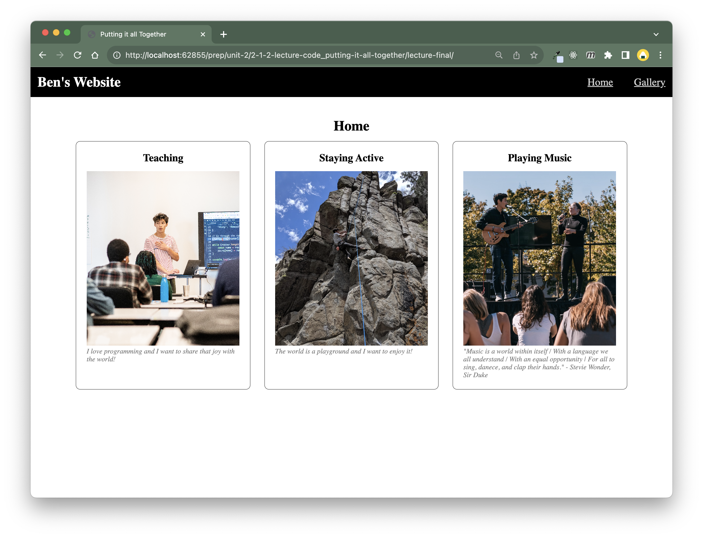

# Putting It All Together

In this lab, you will create a two-page website that uses flexbox and grid to make a beautiful layout! With VERY minimal styling, the website is basically ready for mobile but as the screen size gets bigger, the website starts to look a little sparse. Using media queries, you'll need to adjust the layout to take better advantage of the larger screen size.

This is the **mobile-first** approach. It is great because, typically, you don't need much to make something look good for mobile. When using this design approach, here are two things to remember about grid, flexbox, and media queries:
* Flexbox doesn't really need media queries to scale beautifully
* Grid DOES need media queries to scale beautifully.

## Mockups

### Home page in mobile view:

### Home page in tablet view:

### Home page in desktop view:

### Grid in desktop view:

## Requirements

* Build a 2-page app (home and gallery)
* Shared styles for general themes
* Shared styles for navbar
* Homepage has
  * Navbar styled with flexbox
  * main with 3 cards
    * In mobile view they are stacked
    * In desktop view they are in a row
* Gallery has:
  * Navbar styled with flexbox
  * main with a gallery
    * 3 columns in desktop view
    * 2 columns in tablet view
    * 1 column in mobile view

## Starting Code

Here are best practices to take note of:
* The use of semantic elements:
  * `header` and `main` to structure the entire `body`
  * `ul` and `li` to organize the sets of content elements
* The use of `id` to target unique elements and `class` to target groups of elements
* The use of separate CSS files
  * `style.css` is used for reset styles and for styles that apply to the top-level `header` and `main` elements that are shared across both pages
  * `home.css` has styles just for the home page while `gallery.css` has styles just for the gallery page.
